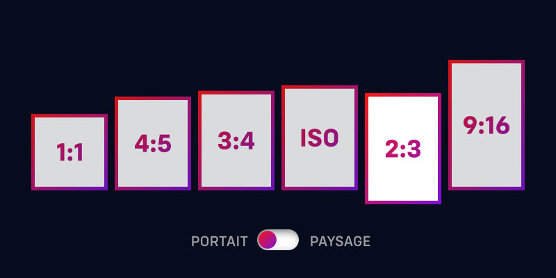

# LA ROTATIVE MILITANTE

Générateur de visuels pour les réseaux sociaux à l'usage des militant·e·s de gauche. Cette WebApp offre un outil simplifié permettant l'utilisation de templates pour générer rapidement des visuels, slides et affiches qui respectent les règles de base de design et permettent à des militant·e·s sans grande connaissance d'être autonomes.

**Technologies utilisées**
* ReactJS
* NextJS

## FONCTIONNALITÉS

### 1. Format

L'utilisateurice aura le choix entre plusieurs formats se déclinant en ***portrait*** et en ***paysage*** :

| portrait | paysage | utilisation |
| :--: | :--: | :-- |
| 1:1 | - | instagram, twitter, etc. |
| 4:5 | 5:4 | instagram, twitter, etc. |
| 3:4 | 4:3 | twitter, facebook, etc. |
| ISO | - | impression A4, A3, etc. |
| 2:3 | 3:2 | twitter, facebook, etc. |
| 9:16 | 16:9 | story instagram |

### 2. Couleur de fond

| couleur | infos | code |
| :-- | :--: | :--: |
| dégradé violet-rouge | LFI rgb | `#7b13d6` / `#f91616` |
| dégradé violet-rouge 2 | LFI cmyk | `#58398e` / `#da3933` |
| dégradé rose-turquoise  | LFI rgb | `#ed5fb1` / `#3885f4` |
| dégradé saumon-bleu  | Jeunes Insoumis | `#d25c50` / `#13235f` |
| violet 1 | LFI rgb | `#7b13d6` |
| violet 2 | LFI cmyk | `#58398e` |
| rouge 1 | LFI rgb | `#f91616` |
| rouge 2 | LFI cmyk | `#da3933` |
| bleu turquoise | LFI rgb | `#3885f4` |
| rose | LFI rgb | `#ed5fb1` |
| vert | LFI rgb | `#2e9959` |
| jaune | LFI rgb | `#f9c900` |
| bleu canard |  | `#008890` |
| bleu foncé | Jeunes Insoumis | `#13235f` |
| rose foncé |  | `#843473` |
| vert foncé |  | `#126c00` |
| vert vif |  | `#4dc104` |
| jaune or |  | `#f0a400` |
| jaune pâle |  | `#fffb56` |
| orange |  | `#ff8518` |
| saumon | Jeunes Insoumis | `#d25c50` |
| crême |  | `#ffdc98` |
| gris 1 |  | `#cbcbcb` |
| gris 2 |  | `#8f8f8f` |
| gris 3 |  | `#444444` |
| gris 4 |  | `#3d3d3d` |
| gris 5 |  | `#212121` |
| marron 1 |  | `#7a3c2d` |
| marron 2 |  | `#744b23` |
| marron 3 |  | `#a98b4e` |

### 3. Texture

- sans
- lin
- grés 
- bruit blanc
- quadrillage
- pointillisme / halftone
- papier chiffoné
- papier gauffré

### 4. Filigrane

L'utilisateurice peut appliquer un filigrane sur tout le slides ou un filigrane différent par slide.

### 5. Fil d'ariane

- x/x
- jauge serrée pleine carrée
- jauge serrée coupée carrée
- jauge serrée pleine arrondie
- jauge serrée coupée arrondie
- jauge étendue pleine
- jauge étendue coupée
- puces rondes 1
- puces rondes 2
- puces carrées 1
- puces carrées 2